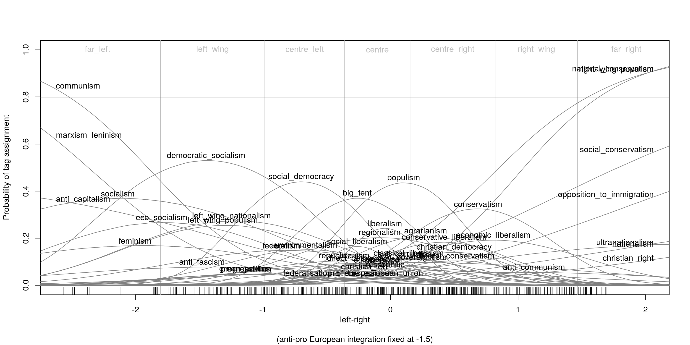
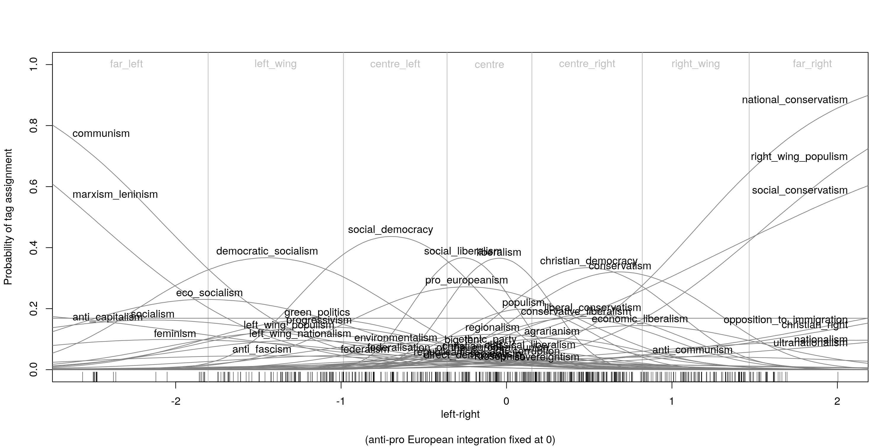
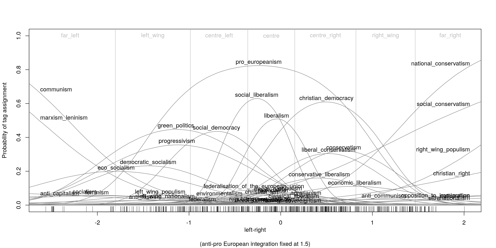
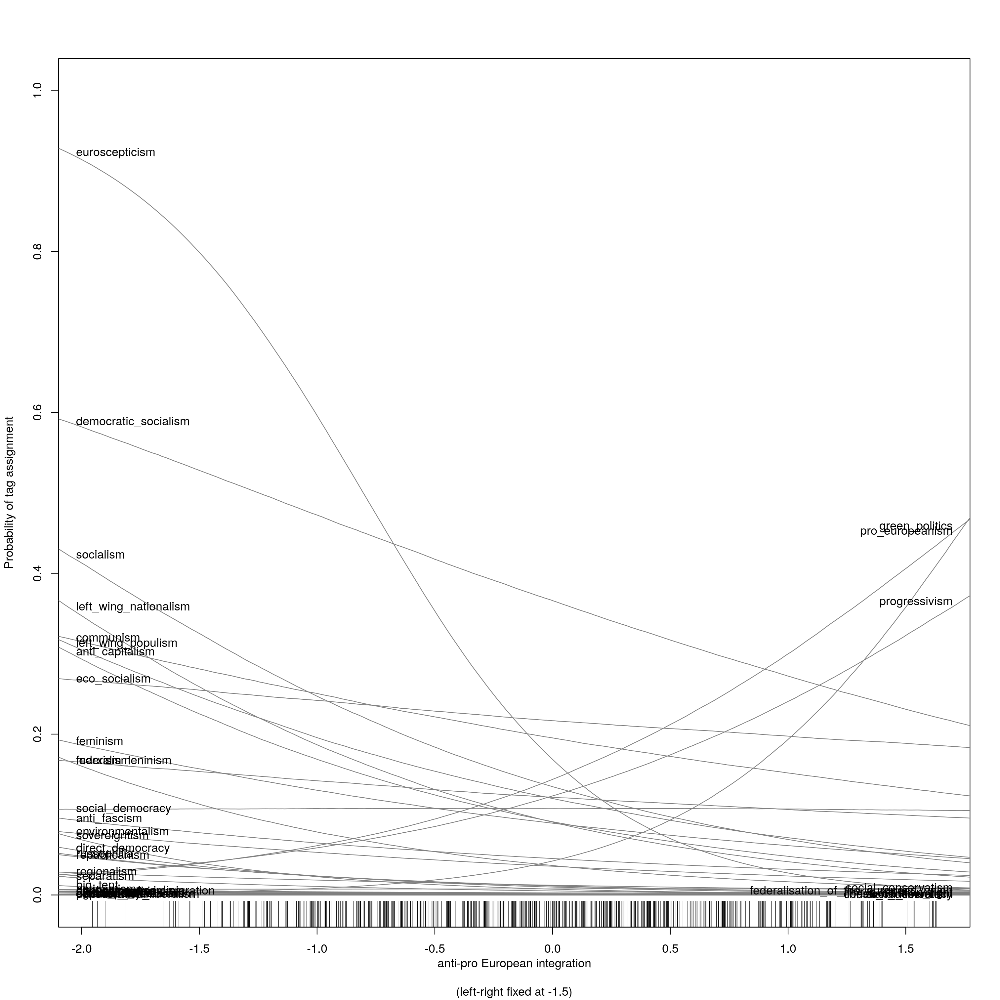
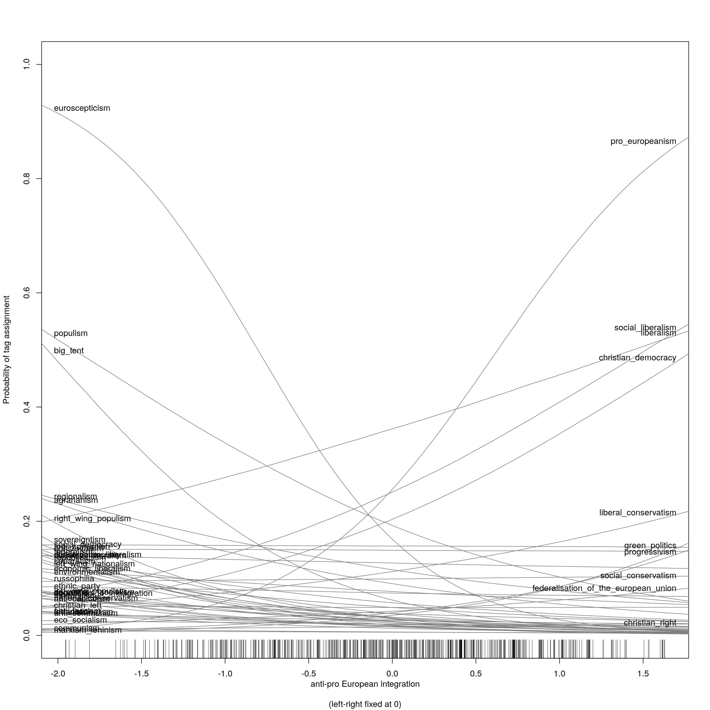
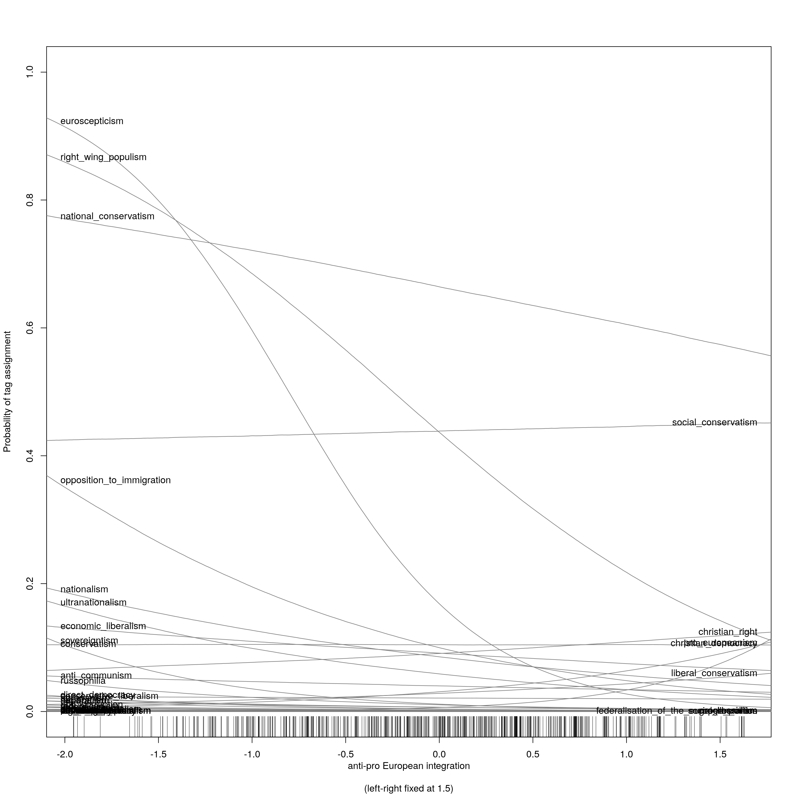

# Estimated response curves

Each plot shows the estimated probability of tag assignment, conditional on party position along the respective dimension, while holding party position on the other dimension constant at the indicated value. 

For example, the first plot below shows the probabilities of tag assignment, conditional on left-right position for parties with an anti-European bend, while the third plot gives the same information for parties with a pro-European bend.

## First dimension

 
 
 

## Second dimension

 
 
 
