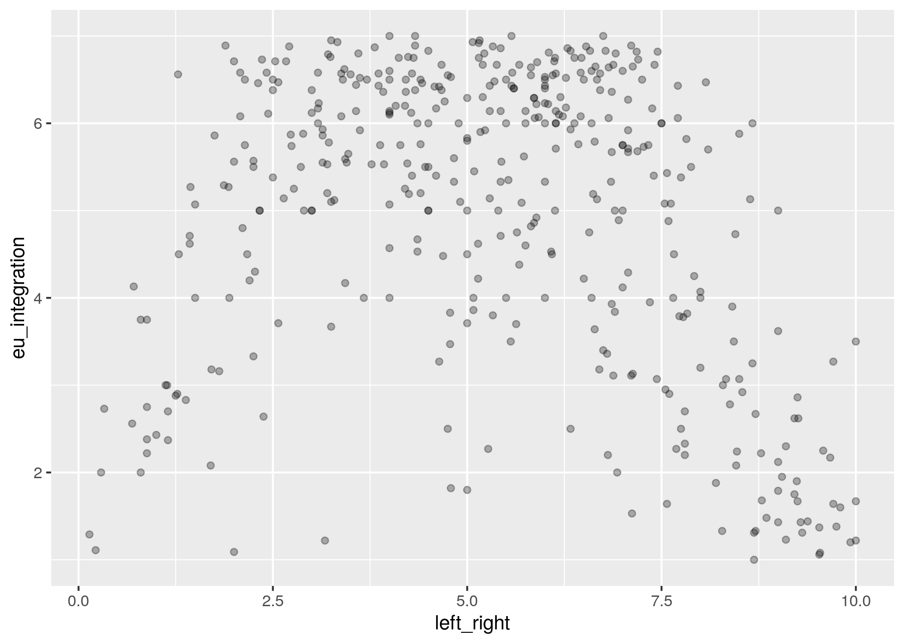
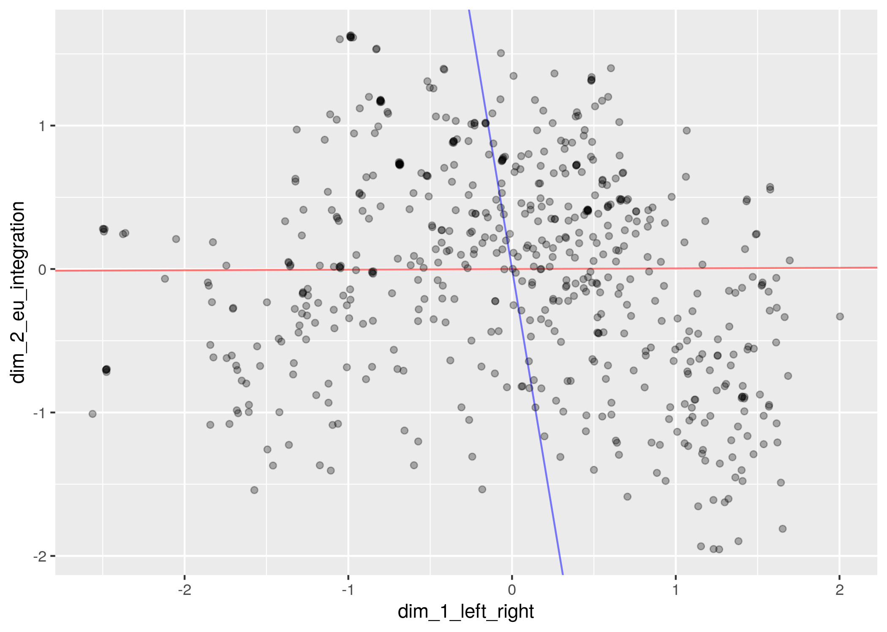

# Two-dimensional party positions from Wikipedia classifications of party ideology

Based on classifications (tags) provided in Wikipedia articles, estimate positions of European parties along two dimensions of political conflict:

1. General ideology: left--right
2. European integration: anti--pro

The project extends the measurement approach presented in [Herrmann & Döring (2021)](https://doi.org/10.1017/pan.2021.28) to two dimensions. The aim is to recover the well-known "arch" shape of party positions in Europe, whereby parties positioned toward the far-left and far-right ends of the political spectrum take more anti-European stances while more moderate parties take more pro-European stances.
  
<p align="center">
  Chapel Hill Expert Survey (CHES) <br>
  
</p>

A [model](#statistical-model) is proposed to accommodate stances on European integration separately from general left-right positions. Party positions are estimated freely (unsupervised) along each dimension.

<p align="center">
  Wikipedia tags <br>
  
</p>

Rulers in the above plot indicate normal vectors from two multiple regressions: one regresses the CHES left-right measure on first and second-dimension Wikipedia scores (red); the other regresses the CHES EU-integration measure on first and second-dimension Wikipedia scores (blue). Ideally, each Wikipedia dimension should explain variation in only one of the two CHES measures in which case the normal vector of the respective regression would run parallel to the dimension that uniquely explains the measure [(cf. Poole 2005: 152-5)](https://books.google.de/books/about/Spatial_Models_of_Parliamentary_Voting.html?id=OmeQNHvcULoC&redir_esc=y).

Party position estimates also show [face validity](03-estimation/estimation-results/response-curves.md), [convergent and discriminant validity](05-validation), and they tend to match the expert ratings more closely than estimates obtained through [correspondence analysis](05-validation).


## Statistical model

A Bayesian latent-variable model of the following form is proposed

$$
x_{i1}^\ast \sim \text{normal}(0, 1)
$$

$$
x_{i2}^\ast \sim \text{normal}(0, 1)
$$

$$
\delta_j^\ast \sim \text{normal}(0, 1)
$$

$$
\lambda_{j1}^\ast \sim \text{normal}(0, 1)
$$

$$
\lambda_{j2}^\ast \sim \text{normal}(0, 1)
$$

$$
\beta_j^\ast \sim \text{exponential}(1)
$$

$$
\tau_k^\ast \sim \text{ordered}(\text{normal}(0, 1))
$$

$$
\gamma^\ast \sim \text{normal}(0, 1)
$$

$$
\Pr(y_{ij} = 1) = \text{logit}^{-1} (\delta_{j}^\ast + \lambda_{j1}^\ast x_{i1}^\ast - \beta_{j}^\ast (x_{i1}^\ast )^2 + \lambda_{j2}^\ast x_{i2}^\ast)
$$

$$
\Pr(z_i = k) = \text{logit}^{-1} (\tau_{k}^\ast - \gamma^\ast x_{i1}^\ast ) - \text{logit}^{-1} (\tau_{k-1}^\ast - \gamma^\ast x_{i1}^\ast),
$$

where $x_{i1}^\ast$ and $x_{i2}^\ast$ represent party $i\text{s}$ positions on the first and second dimension, respectively, $\delta_j^\ast$, $\lambda_j^\ast$, and $\beta_j^\ast$ are ideology-tag parameters (with $\lambda_j^\ast$ indexed by dimension), $\tau^\ast$ and $\gamma^\ast$ are lr-position-tag parameters, $y_{ij}$ is an indicator variable for party $i$ being tagged with ideology $j$, and $z_i$ is a variable whose values $k = 1, 2, ... 7$ indicate (from left to right) the lr-position that party $i$ is tagged with. Note that setting $\lambda_{j2} = 0$ for all $j$ gives the model from [Herrmann & Döring (2021)](https://doi.org/10.1017/pan.2021.28). 

Stars in the above model statement indicate unidentified quantities. Orthogonality restrictions on two response functions are required to identify the dimensions [(cf. Jackman 2001)](https://doi.org/10.1093/polana/9.3.227). The following restrictions were chosen:

1. lr-position tags are unrelated to the second dimension
2. 'euroscepticism' tag is unrelated to the first dimension

The first restriction is implemented through the model for $z$ (lr-position tags), which is one-dimensional and hence orthogonal to the second dimension; this identifies the first dimension. The tag 'euroscepticism' is made orthogonal to the first dimension by fixing $\lambda_{e1}^\ast = \beta_e^\ast = 0$, where $e$ is the index number of the tag 'euroscepticism'; this identifies the second dimension.

To resolve invariance (of the estimation problem) to reflection, each $\lambda_{j1}^\ast$ and $x_{i1}^\ast$ is multiplied by the term

$$
2I(\lambda_{c1}^\ast > 0) - 1
$$

and each $\lambda_{j2}^\ast$ and $x_{i2}^\ast$ is multiplied by

$$
2I(\lambda_{e2}^\ast < 0) - 1,
$$

where $I()$ is the indicator function returning the value 1 if the statement in parentheses is true and 0 otherwise, and $c$ and $e$ are the index numbers of the tags 'conservatism' and 'euroscepticism'.

To resolve invariance (of the estimation problem) to addition and multiplication, party positions are centered at their mean and scaled to standard deviations

$$
\begin{align*}
x_{i1} &= (x_{i1}^\ast - \bar{x}_1^\ast) / \text{SD}(x_1^\ast) \\
x_{i2} &= (x_{i2}^\ast - \bar{x}_2^\ast) / \text{SD}(x_2^\ast),
\end{align*}
$$

where stars denote the unidentified counterparts of the un-starred quantities. The following offsetting transformations are required to leave the estimation problem unchanged and to ensure identification of all tag parameters:

$$
\delta_j = \delta_{j}^\ast + \bar{x}_{1}^\ast (\lambda_{j1}^\ast - 2 \beta_{j}^\ast \bar{x}_{1}^\ast) + \bar{x}_{2}^\ast \lambda_{j2}^\ast
$$

$$
\lambda_{j1} = \text{SD}(x_{1}^\ast) (\lambda_{j1}^\ast - 2 \beta_{j}^\ast \bar{x}_{1}^\ast)
$$

$$
\lambda_{j2} = \text{SD}(x_{2}^\ast) \lambda_{j2}^\ast
$$

$$
\beta_j = \beta_{j}^\ast (\text{SD}(x_{1}^\ast))^2
$$

$$
\tau_k = \tau_{k}^\ast - \gamma^\ast \bar{x}_{1}^\ast
$$

$$
\gamma = \text{SD}(x_{1}^\ast) \gamma^\ast.
$$

The model is estimated in [Stan](https://mc-stan.org) via Hamiltonian Monte Carlo.

---

## Installation

Running all scripts requires R, Python and Stan.

We use [Docker](https://docs.docker.com/get-docker/) as a replication environment. It includes R, RStudio, Python, Stan and all packages (see [Dockerfile](Dockerfile)).

```sh
docker-compose up -d  # start container in detached mode

docker-compose down   # shut down container
```

<http://localhost:8787/> — RStudio in a browser with all dependencies

## Project structure

__Note__ — Using [RStudio project](https://support.rstudio.com/hc/en-us/articles/200526207-Using-Projects) workflow – _0-wp-data.Rproj_. All R scripts use file paths that are relative to the project root directory.

+ [z-run-all.R](z-run-all.R) — stepwise execution all scripts (R and Python)
+ [data-files-docs.csv](data-files-docs.csv) — documentation all datasets (path, type, description)

### Folders

+ __01-data-sources__
  + _01-partyfacts_ — Party Facts data
  + _02-wikipedia_ — Wikipedia data and infobox tags
  + _03-party-positions_ — party position data for validation (CHES)
+ __02-data-preparation__ — create datasets for analysis
+ __03-estimation__ — estimation of model and post-estimation
+ __04-data-final__ — datasets with party and tag positions (1st dimension only for tags)
+ __05-validation__ — validation of party positions and comparison to correspondence analysis
+ __06-figures-tables__ — visualization of results (1st dimension only)

### Data preparation notes

A dataset of Wikipedia tags is created in _02-data-preparation/01-wp-infobox.R_.

+ some minor harmonization of category names
+ selects only categories that are used _twice_

A wide dataset (classification matrix) is created in _02-data-preparation/02-wp-data.R_.

+ manually exclude some incorrect tags (news outlets, publishers, etc.)
+ select countries and time frame for analysis

The final (long) dataset for the analysis is created in _03-estimation/01-preparation-estimation.R_

+ filter most frequent tags — _see parameter_

### Party positions

The expert ratings used for validation are in _01-data-sources/03-party-positions/_

+ Chapel Hill Expert Survey ([CHES](https://www.chesdata.eu/)) – trend file 1999–2019